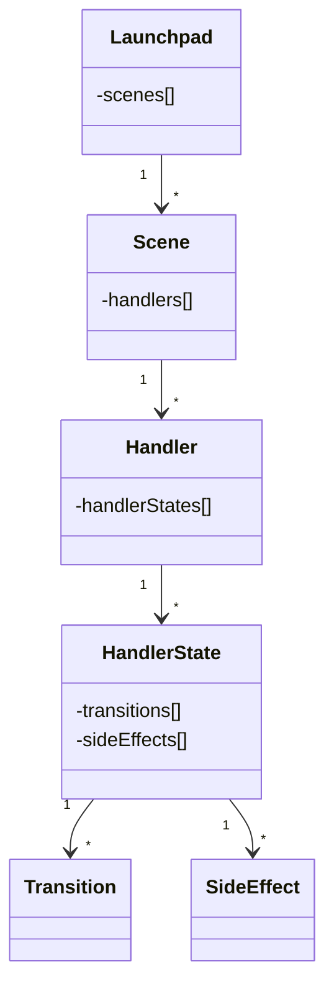

# GN-Launchpad

GN-Launchpad is a JSON-configurable host environment for the novation launchpad.
The motivation of the project is to provide musicians the capability to 
flexibly configure the novation launchpad for custom applications via a 
JSON configuration.

The eventual goal is to have this project work in any MIDI-capable environment
that can run JavaScript, but most of the current effort is to provide 
capability for the Cycling 74 Max. 

The project is evolving, and so is the documentation.

## Main design concepts

The project is designed around the concept of **scenes** and **handlers**.

Each **scene** essentially defines the behavior of the launchpad for a particular application.

For example, the different types of **scenes** can configure the launchpad to act as: a sequencer; a drum machine; a toggle box; a mixer etc.

The following UML diagram represents the basic relationships between **Scenes**, **Handlers**, **Handler States**, **Transitions**, and **Side Effects**



The scenes for the launchpad are configured using a JSON definition with the following structure:

```javascript
{
/* An array of scenes */
"scenes": [{

    /* Ad-hoc name for the current scene */
    "sceneName": string,
    
    /* The index of the current scene */
    "sceneIndex": number,
    
    /* 
     * The handlers available in the current scene.
     * Handlers respond to different types of events,
     * and contain a number of Handler States.
     */
    "handlers": [{
    
        /*
         * The type of event this handler is for. One of: 
         * 'xyButton': the 16 main buttons at the center of the launchpad.
         * 'menuButton': the 8 buttons at the top of the launchpad.
         * 'launchButton': the 8 buttons on the right-hand-side of the launchpad.
         * 'midi': an ad-hoc midi event.  
         */
        "type": enum("xyButton", "menuButton", "launchButton", "midi"),
        
        /*
         * For xyButton events, which row and col the handler is for.
         * Can be a specific value (1-8), or "all" for every row or col.
         */
        "row": "all" or number,
        "col": "all" or number,
        
        /*
         * Handler states represents the differnet states that 
         * the current scene can be in.
         */
        "handlerStates": [{
            /* 
             * State index can be provided explicitely .
             * If not provided, the index will be the state's position in the array. 
             */
            "index": number,
            
            /*
             * The color of the button in the given state.
             */
            "color": "off",
            "transitions": array [{
            
                /* 
                 * Type of event that triggers this transition. One of:
                 * 'push': the button is pushed (non-zero midi velocity),
                 * 'release': the button is relesed (zero midi velocity),
                 * 'hold': the button is pushed, and not released for specified time,
                 * 'holdRelease': hold event followed by release event, 
                 * 'longHold': the button is held for a long time (configurable),
                 * 'longHoldRelease': longHold event followed by release event,
                 * 'doubleTap': similar to double-click mouse event,
                 * 'midiEvent': ad-hoc midi event
                 */
                "eventType": enum('push', 'release', 'hold', 'holdRelease', 'longHold', 'longHoldRelease', 'doubleTap', 'midiEvent'),
                
                /*
                 * Index of the state to transition to for the given event.
                 */
                "toIndex": number
            }]
        },
        {
            "index": 1,
            "color": "red",
            "transitions": [{
                "eventType": "push",
                "toIndex": 0
            }],
            "sideEffects": [{
                "row": "same",
                "col": "all",
                "color": "off"
            }]
        }]
    }]
    
}]
```

## Configuration

Configuration is done via the JSON files in the **config** directory.

The following are the configuration files, and their role:

### launchpad_config.json

This file contains the global configuration settings.

```javascript
{
    /** 
     * Filepath to the scenes configuration file. 
     * Default location is 'config/launchpad_scenes.json'.
     */
     
    "launchpadScenesPath": string,
    
    /**
     * Time, in ms, which constitutes a 'hold' event.
     */
    "holdTime": number,
    
    /**
     * Time, in ms, which constitutes a 'long hold' event.
     */
    "longHoldTime": number,
}
```
### launchpad_scenes.json
The scenes configuration.

The scenes configuration essentially defines the behavior of the launchpad.

Each scene is 

This is the default scenes configuration. The scenes essentially define the behavior of the launchpad. 
A single scene represents the the state of the launchpad at any given time.
```javascript
{
/* An array of scenes */
"scenes": [{

    /* Ad-hoc name for the current scene */
    "sceneName": string,
    
    /* The index of the current scene */
    "sceneIndex": number,
    
    /* 
     * The handlers available in the current scene.
     * Handlers respond to different types of events,
     * and contain a number of Handler States.
     */
    "handlers": [{
    
        /*
         * The type of event this handler is for. One of: 
         * 'xyButton': the 16 main buttons at the center of the launchpad.
         * 'menuButton': the 8 buttons at the top of the launchpad.
         * 'launchButton': the 8 buttons on the right-hand-side of the launchpad.
         * 'midi': an ad-hoc midi event.  
         */
        "type": enum("xyButton", "menuButton", "launchButton", "midi"),
        
        /*
         * For xyButton events, which row and col the handler is for.
         * Can be a specific value (1-8), or "all" for every row or col.
         */
        "row": "all" or number,
        "col": "all" or number,
        
        /*
         * Handler states represents the differnet states that 
         * the current scene can be in.
         */
        "handlerStates": [{
            /* 
             * State index can be provided explicitely .
             * If not provided, the index will be the state's position in the array. 
             */
            "index": number,
            
            /*
             * The color of the button in the given state.
             */
            "color": "off",
            "transitions": array [{
            
                /* 
                 * Type of event that triggers this transition. One of:
                 * 'push': the button is pushed (non-zero midi velocity),
                 * 'release': the button is relesed (zero midi velocity),
                 * 'hold': the button is pushed, and not released for specified time,
                 * 'holdRelease': hold event followed by release event, 
                 * 'longHold': the button is held for a long time (configurable),
                 * 'longHoldRelease': longHold event followed by release event,
                 * 'doubleTap': similar to double-click mouse event,
                 * 'midiEvent': ad-hoc midi event
                 */
                "eventType": enum('push', 'release', 'hold', 'holdRelease', 'longHold', 'longHoldRelease', 'doubleTap', 'midiEvent'),
                
                /*
                 * Index of the state to transition to for the given event.
                 */
                "toIndex": number
            }]
        },
        {
            "index": 1,
            "color": "red",
            "transitions": [{
                "eventType": "push",
                "toIndex": 0
            }],
            "sideEffects": [{
                "row": "same",
                "col": "all",
                "color": "off"
            }]
        }]
    }]
    
}]